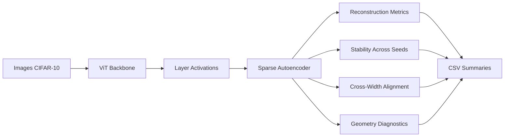
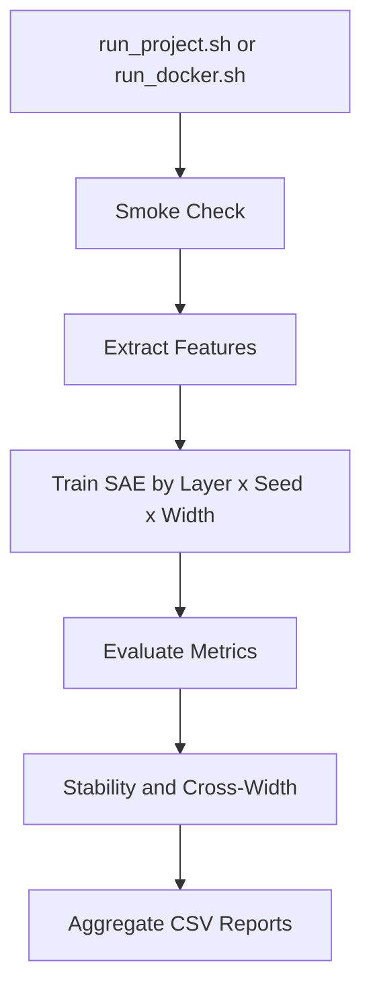

# VisionSAE: Interpreting Vision Transformers with Sparse Autoencoders

[](https://www.python.org/)
[](https://pytorch.org/)
[](https://www.docker.com/)
[](#architecture)
[](#appendix)


VisionSAE is a reproducible pipeline for studying how visual features emerge inside Vision Transformers (ViTs). It trains sparse autoencoders (SAEs) on intermediate transformer activations and evaluates feature quality with reconstruction, stability, cross-width alignment, and geometry metrics.

## Problem

Vision Transformers are highly effective but difficult to interpret internally. Typical workflows measure prediction quality, not the structure of latent visual features across layer depth, model width, and random seed.

## Solution

VisionSAE adds a practical interpretability layer on top of ViT activations:

- Layer-wise activation extraction.
- Sparse autoencoder training with top-k latent sparsity.
- Reconstruction and geometry diagnostics.
- Cross-seed stability analysis.
- Cross-width feature alignment analysis.
- JSON/CSV summaries for reporting and comparison.

## Architecture

For an activation vector $x$ from a selected ViT layer:

$$
z = \text{Encoder}(x), \quad \hat{x} = \text{Decoder}(z)
$$

Optimization target:

$$
\mathcal{L} = \lVert x - \hat{x} \rVert_2^2 + \lambda \cdot \text{SparsityPenalty}(z)
$$

System flow:



## Demo Command

Local quick demo:

```bash
bash run_project.sh
```

Docker quick demo:

```bash
./run_docker.sh cpu
```

GPU quick demo:

```bash
./run_docker.sh gpu
```

Full run:

```bash
bash run_project.sh --mode full
./run_docker.sh cpu full
```

## Results

<!-- RESULTS_SNAPSHOT_START -->
Snapshot from current CSV summaries:

| Metric | Value |
| --- | --- |
| Total evaluated runs | 108 |
| Mean MSE | 0.3672 |
| Mean sparsity | 0.9929 |
| Mean coherence | 0.2022 |
| Mean stability score | 0.1328 |
| Mean cross-width alignment | 0.1385 |

Width trend highlights:

| Width | Mean MSE | Mean Stability |
| --- | --- | --- |
| 4096 | 0.3901 | 0.1263 |
| 8192 | 0.3574 | 0.1329 |
| 16384 | 0.3541 | 0.1390 |

Interpretation: in these runs, larger SAE width is associated with better (lower) reconstruction error and stronger cross-seed stability.
<!-- RESULTS_SNAPSHOT_END -->

## Why This Matters

- Converts ViT internals from black-box behavior into measurable structure.
- Makes interpretability reproducible with one-command local and Docker runs.
- Produces concise outputs suitable for technical review and hiring screens.
- Establishes a scalable foundation for larger datasets and backbones.

## Appendix

### Experiment Matrix

| Axis | Default |
| --- | --- |
| Dataset | CIFAR-10 |
| Backbone | ViT Base Patch16 224 |
| Layers | 0-11 |
| Widths | 4096, 8192, 16384 |
| Seeds | 42, 123, 999 |

Run orchestration flow:



### Run Modes

### Local setup (manual)

```bash
python -m venv .venv
source .venv/bin/activate
python -m pip install --upgrade pip
python -m pip install -r requirements.txt
python -m scripts.smoke_check
```

### End-to-end runner

Quick mode:

```bash
python -m scripts.run_end_to_end --mode quick
```

Full mode:

```bash
python -m scripts.run_end_to_end --mode full
```

Custom scope:

```bash
python -m scripts.run_end_to_end --layers 0,1 --seeds 42,123 --widths 4096,8192
```

Note: if CUDA is unavailable, the runner automatically uses a temporary CPU config.

### Docker

Helper script:

```bash
./run_docker.sh cpu
./run_docker.sh gpu
./run_docker.sh cpu full
```

Compose commands:

```bash
docker compose run --rm visionsae-cpu
docker compose --profile gpu run --rm visionsae-gpu
```

Build images directly:

```bash
docker build -f docker/Dockerfile.cpu -t visionsae:cpu .
docker build -f docker/Dockerfile.gpu -t visionsae:gpu .
```

### Detailed Commands

Extract features:

```bash
python -m scripts.extract_features --config configs/vit_base_cifar.yaml --layer 0
```

Train SAE:

```bash
python -m scripts.train_layer --config configs/vit_base_cifar.yaml --layer 0
```

Evaluate SAE:

```bash
python -m scripts.evaluate_layer --config configs/vit_base_cifar.yaml --layer 0
```

Run stability sweep:

```bash
python -m experiments.run_full_stability_sweep
```

Run cross-width sweep:

```bash
python -m experiments.run_cross_width_sweep
```

Aggregate final summaries:

```bash
python -m experiments.aggregate_results
python -m experiments.aggregate_stability
python -m experiments.aggregate_cross_width
```

### Outputs

Generated artifacts:

- `results/raw` for per-run metric JSON files.
- `results/stability` for cross-seed alignment outputs.
- `results/cross_width` for cross-width outputs.
- `results_summary.csv`.
- `stability_summary.csv`.
- `cross_width_summary.csv`.

### Repository Map

```text
configs/       experiment configuration
data/          dataloaders
models/        ViT and SAE modules
training/      trainer and losses
analysis/      metrics and interpretability utilities
alignment/     similarity and matching logic
experiments/   sweeps and aggregation scripts
scripts/       extraction, train, eval, smoke, end-to-end
docker/        Dockerfiles and container entrypoint
```

### Key Findings

- SAEs recover structured visual feature directions from intermediate ViT states.
- Wider SAEs typically improve cross-seed stability.
- Earlier transformer layers often align better than deeper layers.
- Deeper layers show stronger redundancy signatures in some settings.

### Reproducibility

- Deterministic seed controls are built into workflows.
- Results are stored as JSON and aggregated into CSV.
- Large artifacts (checkpoints and extracted features) are excluded from source control.

### Visualization

Notebook entrypoint:

```text
notebooks/interpretability_analysis.ipynb
```

### Cite This Work

Citation metadata is available in `CITATION.cff`.

BibTeX:

```bibtex
@software{visionsae_2026,
  title = {VisionSAE: Interpreting Vision Transformers with Sparse Autoencoders},
  author = {{VisionSAE Contributors}},
  year = {2026},
  version = {0.1.0}
}
```

### License

This repository does not yet include a formal license file. Current usage is best treated as research/demo usage until a license is added.
